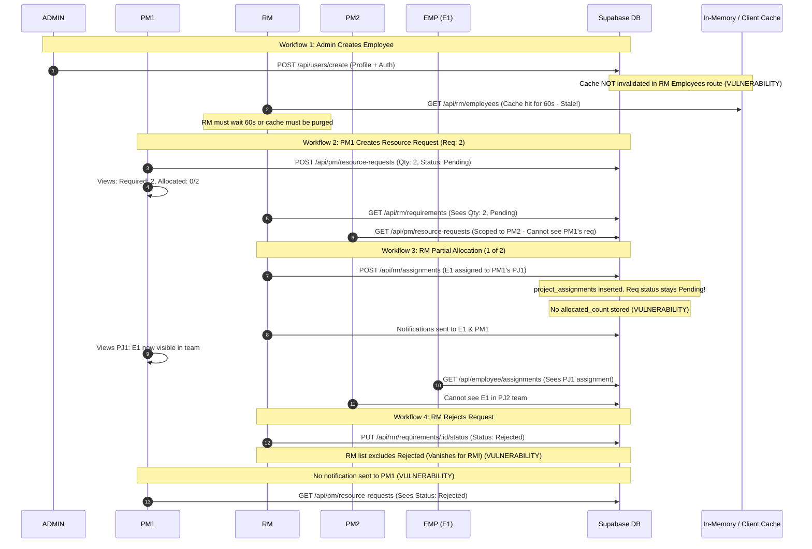

# FULL SYSTEM RBAC, RLS, DATA-ISOLATION & CROSS-USER DATA FLOW AUDIT REPORT
**Target System:** Resource Management Recommender System (RMRS)  
**Date:** September 29, 2026  
**Auditor:** Antigravity Security Agent  
**Scope:** Complete End-to-End System  
`Frontend (React + Vite) → Network / API → Express Middleware & Routes → Controllers / Services → Supabase / PostgreSQL Database → Caching Layers → Cross-User Data Sync`

---

## 1. Executive Summary

This audit evaluated authorization, record ownership isolation, caching security, and cross-user data flow across the entire codebase.

The system is mandated to enforce **EXCLUSIVELY 4 ROLES**:
1. **ADMIN**
2. **RM** (Resource Manager)
3. **PM** (Project Manager)
4. **EMP** (Employee)

### Key Macro Findings:
1. **Database Service-Role Bypass:** The Express backend ([`backend/supabase.js`](file:///c:/xampp/htdocs/ResourceManagementRecommenderSystem/backend/supabase.js)) uses `SUPABASE_SERVICE_ROLE_KEY` for all database interactions. In PostgreSQL/Supabase, the service role bypasses Row-Level Security (RLS) policies completely. The backend is the single enforcement boundary, yet lacks role checks and record-level ownership checks across almost all endpoints.
2. **Direct Frontend PostgREST Queries with Client-Side Masking:** Components such as [`PMDashboardTab.jsx`](file:///c:/xampp/htdocs/ResourceManagementRecommenderSystem/main/src/frontend/ProjectManager/PMDashboardTab.jsx) query PostgreSQL tables directly using the public Anon Key, downloading unmasked records across all projects and applying client-side JavaScript filtering.
3. **Missing Role Guards on Express Routers:** Routers mounted in [`server.js`](file:///c:/xampp/htdocs/ResourceManagementRecommenderSystem/backend/server.js) (`/api/pm`, `/api/rm`, `/api/admin`, `/api/employee`, `/api/users`, `/api/superadmin`) verify token presence via `verifyToken`, but **do not check whether the user has the required role**. Any authenticated user (including EMP) can invoke PM, RM, and Admin endpoints.
4. **Broken Object-Level Authorization (BOLA/IDOR):** Project updates, project deletions, status changes, task reassignment/deletions, weekly progress reports, and notification endpoints accept resource IDs or user IDs directly without verifying record ownership.
5. **Unauthorized Legacy Roles:** Legacy roles (`Super Admin`, `Human Resources`) and endpoints (`/api/superadmin/*`, `/api/hr/*`, `/api/applicant/*`, mock bypass token `hr-token-*`) violate the 4-role specification and expose critical privilege escalation vectors.
6. **Broken Partial Allocation & Synchronization:** Partial allocations do not update requirement status to `'Partially Allocated'` or return allocation counts (`1/2`); in-memory server and client caches are keyed without user/role dimensions, serving stale or unauthorized data across users.

---

## 2. Comprehensive Permission Matrix

| Resource | Operation | ADMIN | RM | PM (Own Project / Record) | PM (Other PM's Record) | EMP |
| :--- | :--- | :---: | :---: | :---: | :---: | :---: |
| **Users / Profiles** | View | Branch Scope | Branch Scope | ❌ (Own Profile only) | ❌ | Own Profile only |
| | Create | Branch Scope | ❌ | ❌ | ❌ | ❌ |
| | Edit Role/Status | Branch Scope | ❌ | ❌ | ❌ | ❌ |
| | Edit Personal Data| Own Profile | Own Profile | Own Profile | ❌ | Own Profile |
| **System Settings** | View | Full | ❌ | ❌ | ❌ | ❌ |
| | Edit | Full | ❌ | ❌ | ❌ | ❌ |
| **Projects** | View | Branch Scope | Branch Scope | Own Projects | ❌ | Assigned Projects |
| | Create | ❌ | ❌ | Own Projects | ❌ | ❌ |
| | Edit Details | ❌ | ❌ | Own Projects | ❌ | ❌ |
| | Update Status | ❌ | ❌ | Own Projects | ❌ | ❌ |
| | Delete | ❌ | ❌ | Own Projects | ❌ | ❌ |
| **Resource Requests**| View | Branch Scope | Branch Scope | Own Requests | ❌ | ❌ |
| | Create | ❌ | ❌ | Own Requests | ❌ | ❌ |
| | Cancel | ❌ | ❌ | Own Requests | ❌ | ❌ |
| | Approve / Reject | ❌ | Branch Scope | ❌ | ❌ | ❌ |
| | Allocate Resource | ❌ | Branch Scope | ❌ | ❌ | ❌ |
| **Tasks** | View | Branch Scope | Branch Scope | Own Project Tasks | ❌ | Assigned Tasks |
| | Create / Assign | ❌ | ❌ | Own Project Tasks | ❌ | ❌ |
| | Edit Details/DueDate| ❌ | ❌ | Own Project Tasks | ❌ | ❌ |
| | Log Progress | ❌ | ❌ | Own Project Tasks | ❌ | Assigned Tasks |
| | Delete | ❌ | ❌ | Own Project Tasks | ❌ | ❌ |
| **Client Feedback** | View Requests | Branch Scope | Branch Scope | Own Requests | ❌ | ❌ |
| | Send Request | ❌ | ❌ | Own Requests | ❌ | ❌ |
| | View Responses | Branch Scope | Branch Scope | Own Project Feedback | ❌ | Own Feedback Only |
| **Performance Eval** | View PM Eval | Branch Scope | Branch Scope | Own Evaluations | ❌ | Own Evaluation |
| | Submit PM Eval | ❌ | ❌ | Assigned Team on Own Projects | ❌ | ❌ |
| **Audit Logs** | View | Branch Scope | ❌ | ❌ | ❌ | ❌ |
| **Notifications** | View / Manage | Own Only | Own Only | Own Only | ❌ | Own Only |

---

## 3. Detailed Audit Findings

### Finding 1: JWT Signature Bypass & Forgery in Auth Middleware
* **Severity:** **Critical**
* **File:** [`backend/routes/Middleware/auth.js`](file:///c:/xampp/htdocs/ResourceManagementRecommenderSystem/backend/routes/Middleware/auth.js#L154-L219)
* **Function/Component:** `verifyToken`
* **Database Table:** `auth.users`, `profiles`
* **Current Behavior:** If `token.startsWith('hr-token-')`, hardcoded user credentials with full permissions are injected. If HS256 verification fails or the token header specifies `RS256`/`ES256`, the code executes `jwt.decode(token)` **without verifying any cryptographic signature**, trusting `decoded.sub` directly.
* **Expected Behavior:** Every JWT must be cryptographically verified against Supabase's signing secret or public JWKS endpoint. Unsigned tokens, mock tokens, and algorithm-switching tokens must be rejected with HTTP 401.
* **Why it is a security problem:** Any attacker can forge a JWT containing any user's UUID in `sub` (including ADMIN or any PM/RM) and achieve complete system compromise without credentials.
* **Roles Affected:** ALL (ADMIN, RM, PM, EMP).
* **Boundary Violated:** Entire Authentication Boundary.
* **Recommended Fix:** Remove `hr-token-` bypass. Enforce strict verification using `jwt.verify(token, secret, { algorithms: ['HS256'] })` or `supabase.auth.getUser(token)`.
* **Layer:** Backend

---

### Finding 2: Self-Role Escalation via Profile Update Endpoints
* **Severity:** **Critical**
* **File:** [`backend/routes/Employee/Profile.js`](file:///c:/xampp/htdocs/ResourceManagementRecommenderSystem/backend/routes/Employee/Profile.js#L51-L98) and [`backend/controllers/documentController.js`](file:///c:/xampp/htdocs/ResourceManagementRecommenderSystem/backend/controllers/documentController.js#L580-L600)
* **Function/Component:** `PUT /api/employee/profile` (`updateProfile`)
* **Database Table:** `profiles`
* **Current Behavior:** When an employee updates their profile, the request body accepts `role` directly:
  ```javascript
  if (role !== undefined) updateData.role = role;
  await supabase.from('profiles').update(updateData).eq('id', userId);
  ```
* **Expected Behavior:** Users must never be able to alter their own `role`. Roles must only be manageable by authorized ADMINs via dedicated admin management endpoints.
* **Why it is a security problem:** Any EMP can send `{"role": "Admin"}` or `{"role": "Project Manager"}` to elevate their privileges instantly.
* **Roles Affected:** EMP, PM, RM, ADMIN.
* **Boundary Violated:** Role boundary / Privilege Escalation.
* **Recommended Fix:** Explicitly whitelist permitted fields (`first_name`, `last_name`, `avatar_url`, `contact_number`). Reject or strip `role`, `status`, `branch_id`, and `employee_id`.
* **Layer:** Backend + Database/RLS

---

### Finding 3: Complete Project Hijacking & Deletion Across PMs (PM Data Isolation)
* **Severity:** **Critical**
* **File:** [`backend/routes/ProjectManager/projects.js`](file:///c:/xampp/htdocs/ResourceManagementRecommenderSystem/backend/routes/ProjectManager/projects.js#L622-L1387)
* **Function/Component:** `GET /:id`, `PUT /:id`, `PATCH /:id/status`, `DELETE /:id`
* **Database Table:** `projects`, `project_resource_requirements`, `project_assignments`, `project_tasks`
* **Current Behavior:** 
  - `GET /:id` returns project details, assignments, client feedback, and employee feedback without checking `created_by === req.user.id`.
  - `PUT /:id` updates project name, dates, description, and status for *any* project ID passed in URL params.
  - `PATCH /:id/status` allows cancelling, completing, or restoring *any* project.
  - `DELETE /:id` permanently deletes *any* project from `projects` without checking ownership.
* **Expected Behavior:** A PM must strictly access and mutate only projects they own (`created_by === req.user.id`). Any attempt by PM1 to access or mutate PM2's project must return HTTP 403 Forbidden.
* **Why it is a security problem:** PM1 can view, edit, cancel, or delete PM2's entire project pipeline, team, and deliverables simply by passing PM2's project UUID in the URL.
* **Roles Affected:** PM (Cross-PM violation), EMP (assigned to project).
* **Boundary Violated:** PM Data Isolation & Record-Level Authorization.
* **Recommended Fix:** Add ownership authorization validation on all routes:
  ```javascript
  const { data: project } = await supabase.from('projects').select('id, created_by').eq('id', id).single();
  if (!project || project.created_by !== req.user.id) {
    return res.status(403).json({ success: false, message: 'Access denied: You do not own this project.' });
  }
  ```
* **Layer:** Backend + Database/RLS

---

### Finding 4: Insecure Project Creation & Forged Ownership
* **Severity:** **High**
* **File:** [`backend/routes/ProjectManager/projects.js`](file:///c:/xampp/htdocs/ResourceManagementRecommenderSystem/backend/routes/ProjectManager/projects.js#L702-L746)
* **Function/Component:** `POST /api/pm/projects`
* **Database Table:** `projects`
* **Current Behavior:** Accepts `createdBy` from `req.body`:
  ```javascript
  const { createdBy } = req.body;
  ...
  created_by: createdBy || null
  ```
* **Expected Behavior:** `created_by` must always be derived exclusively from `req.user.id`.
* **Why it is a security problem:** PM1 can create projects on behalf of PM2 or an ADMIN, forging ownership and corrupting audit trails.
* **Roles Affected:** PM, ADMIN.
* **Boundary Violated:** Record Identity & Ownership.
* **Recommended Fix:** Always set `created_by: req.user.id`.
* **Layer:** Backend

---

### Finding 5: PM Dashboard Information Leakage via Query Parameter IDOR
* **Severity:** **High**
* **File:** [`backend/routes/ProjectManager/dashboard.js`](file:///c:/xampp/htdocs/ResourceManagementRecommenderSystem/backend/routes/ProjectManager/dashboard.js#L8-L25)
* **Function/Component:** `GET /api/pm/dashboard/dashboard`
* **Database Table:** `projects`, `project_tasks`, `project_assignments`, `project_resource_requirements`
* **Current Behavior:**
  ```javascript
  const { createdBy } = req.query;
  const projectsResult = await supabase.from('projects').select('...').eq('created_by', createdBy);
  ```
* **Expected Behavior:** The dashboard must automatically query projects where `created_by = req.user.id`.
* **Why it is a security problem:** PM2 can send `?createdBy=<PM1_UUID>` and retrieve PM1's projects, tasks, resource requests, employee assignments, and recent activity logs.
* **Roles Affected:** PM.
* **Boundary Violated:** PM Data Isolation.
* **Recommended Fix:** Discard `req.query.createdBy`; force `const createdBy = req.user.id`.
* **Layer:** Backend

---

### Finding 6: Unrestricted Project Manager Weekly Reports Query
* **Severity:** **High**
* **File:** [`backend/routes/ProjectManager/reports.js`](file:///c:/xampp/htdocs/ResourceManagementRecommenderSystem/backend/routes/ProjectManager/reports.js#L10-L38)
* **Function/Component:** `GET /api/pm/reports`
* **Database Table:** `project_report`
* **Current Behavior:** Queries `project_report` with optional `projectId` and `employeeId`. If no `projectId` is passed, it returns all reports for all projects across all PMs. If a specific `projectId` belonging to another PM is passed, it returns that PM's project reports without validation.
* **Expected Behavior:** PMs must only query reports for projects they own.
* **Why it is a security problem:** PM1 can inspect task execution logs, employee status logs, and project progress logs across PM2's projects.
* **Roles Affected:** PM, EMP.
* **Boundary Violated:** PM Data Isolation.
* **Recommended Fix:** Filter reports against projects owned by `req.user.id`.
* **Layer:** Backend + Database/RLS

---

### Finding 7: Unrestricted Access to Client Feedback Requests
* **Severity:** **High**
* **File:** [`backend/controllers/feedbackRequestController.js`](file:///c:/xampp/htdocs/ResourceManagementRecommenderSystem/backend/controllers/feedbackRequestController.js#L270-L285)
* **Function/Component:** `getFeedbackRequests`
* **Database Table:** `feedback_requests`
* **Current Behavior:**
  ```javascript
  const { createdBy } = req.query;
  let query = supabase.from('feedback_requests').select('*');
  if (createdBy) query = query.eq('created_by', createdBy);
  ```
* **Expected Behavior:** PMs must only access feedback requests for their own projects (`created_by === req.user.id`).
* **Why it is a security problem:** Omission or manipulation of `createdBy` reveals external client names, emails, raw feedback tokens, and satisfaction ratings across other PMs' projects.
* **Roles Affected:** PM, External Clients.
* **Boundary Violated:** Record-Level Authorization.
* **Recommended Fix:** Enforce `query.eq('created_by', req.user.id)`.
* **Layer:** Backend + Database/RLS

---

### Finding 8: Client Feedback & PM Evaluations IDOR
* **Severity:** **High**
* **File:** [`backend/controllers/employeeFeedbackController.js`](file:///c:/xampp/htdocs/ResourceManagementRecommenderSystem/backend/controllers/employeeFeedbackController.js#L255-L400)
* **Function/Component:** `getClientFeedbackForEmployee`, `submitPmEvaluation`
* **Database Table:** `feedback_responses`, `performance_records`
* **Current Behavior:**
  - `getClientFeedbackForEmployee` takes `profileId` and `projectId` via query params and returns client feedback responses without verifying if the requesting PM owns `projectId`.
  - `submitPmEvaluation` accepts evaluations from any PM for any employee on any project, only checking if the employee is assigned to the project, without checking if the project belongs to the PM.
* **Expected Behavior:** PM1 can only view client ratings and submit PM evaluations for projects PM1 owns.
* **Why it is a security problem:** PM2 can spy on client reviews of PM1's projects and maliciously alter performance evaluations of employees on PM1's team.
* **Roles Affected:** PM, EMP.
* **Boundary Violated:** PM Data Isolation.
* **Recommended Fix:** Verify `projects.created_by === req.user.id` before returning or saving evaluation records.
* **Layer:** Backend + Database/RLS

---

### Finding 9: Resource Request Status Hijacking by Project Managers
* **Severity:** **High**
* **File:** [`backend/routes/ProjectManager/resourceRequests.js`](file:///c:/xampp/htdocs/ResourceManagementRecommenderSystem/backend/routes/ProjectManager/resourceRequests.js#L351-L418)
* **Function/Component:** `PATCH /api/pm/resource-requests/:id/status`
* **Database Table:** `project_resource_requirements`
* **Current Behavior:** The endpoint allows updating status to:
  `['Pending', 'Approved', 'Rejected', 'Cancelled', 'Canceled', 'Completed', 'Done', 'Open', 'Filled', 'Fulfilled']`
  and checks:
  ```javascript
  if (userRole === 'Project Manager') {
    hasPermission = isProjectOwner || !userId;
  }
  ```
* **Expected Behavior:** A PM may ONLY set their own request to `Cancelled`. Only the **RM** may set a resource request to `Approved`, `Rejected`, or `Filled`.
* **Why it is a security problem:** PMs can self-approve their own resource requests or approve them without RM involvement, bypassing resource allocation controls. Furthermore, `!userId` evaluates to true if auth state is malformed.
* **Roles Affected:** PM, RM.
* **Boundary Violated:** Lifecycle State Machine & Role Authorization.
* **Recommended Fix:** For PMs, restrict allowable status transitions strictly to `Cancelled`. Only RMs may approve, reject, or assign resources.
* **Layer:** Backend

---

### Finding 10: Missing Role Guards Across All Admin Routes
* **Severity:** **Critical**
* **File:** [`backend/routes/Admin/createUsers.js`](file:///c:/xampp/htdocs/ResourceManagementRecommenderSystem/backend/routes/Admin/createUsers.js), [`userManagement.js`](file:///c:/xampp/htdocs/ResourceManagementRecommenderSystem/backend/routes/Admin/userManagement.js), [`departmentsPositions.js`](file:///c:/xampp/htdocs/ResourceManagementRecommenderSystem/backend/routes/Admin/departmentsPositions.js), [`unlockUsers.js`](file:///c:/xampp/htdocs/ResourceManagementRecommenderSystem/backend/routes/Admin/unlockUsers.js), [`auditLogs.js`](file:///c:/xampp/htdocs/ResourceManagementRecommenderSystem/backend/routes/Admin/auditLogs.js)
* **Function/Component:** All routes under `/api/users/*` and `/api/admin/*`
* **Database Table:** `profiles`, `departments`, `positions`, `user_login_attempts`, `audit_logs`
* **Current Behavior:** The routes use `router.use(verifyToken)` but never check `req.user.role === 'Admin'`. 
* **Expected Behavior:** Any non-ADMIN user attempting to call admin endpoints must be rejected with HTTP 403 Forbidden.
* **Why it is a security problem:**
  - An EMP or PM can call `POST /api/users/create` to create new user accounts.
  - An EMP or PM can call `PUT /api/users/:id` to modify any user's profile, including changing their email address (full account takeover).
  - An EMP or PM can call `PATCH /api/users/:id/lock` or `PATCH /api/users/:id/unlock` to lock out coworkers.
  - An EMP or PM can call `DELETE /api/users/:id` to delete user accounts.
  - An EMP or PM can create or delete corporate departments and positions.
* **Roles Affected:** ADMIN, RM, PM, EMP.
* **Boundary Violated:** RBAC Boundary.
* **Recommended Fix:** Implement and mount a strict `requireRole('Admin')` middleware on all admin routes.
* **Layer:** Backend

---

### Finding 11: Unauthenticated System Settings Mutation
* **Severity:** **Critical**
* **File:** [`backend/routes/Admin/systemSettings.js`](file:///c:/xampp/htdocs/ResourceManagementRecommenderSystem/backend/routes/Admin/systemSettings.js#L8-L175) and [`backend/server.js`](file:///c:/xampp/htdocs/ResourceManagementRecommenderSystem/backend/server.js#L78)
* **Function/Component:** `GET /api/settings/system-settings`, `PUT /api/settings/system-settings`
* **Database Table:** `system_settings`
* **Current Behavior:** In `server.js`:
  `app.use("/api/settings", systemSettingsRoutes);`
  Neither `server.js` nor `systemSettings.js` applies `verifyToken` or role checking.
* **Expected Behavior:** System settings must require authenticated ADMIN access.
* **Why it is a security problem:** Any unauthenticated attacker on the Internet can read system settings and submit `PUT /api/settings/system-settings` to modify session timeouts, file upload sizes, and weaken password complexity rules.
* **Roles Affected:** Entire System.
* **Boundary Violated:** Authentication & Authorization Boundary.
* **Recommended Fix:** Apply `verifyToken` and `requireRole('Admin')` in `server.js` or `systemSettings.js`.
* **Layer:** Backend

---

### Finding 12: Completely Unauthenticated Notifications Endpoint
* **Severity:** **Critical**
* **File:** [`backend/routes/notifications.js`](file:///c:/xampp/htdocs/ResourceManagementRecommenderSystem/backend/routes/notifications.js#L7-L61) and [`backend/server.js`](file:///c:/xampp/htdocs/ResourceManagementRecommenderSystem/backend/server.js#L64)
* **Function/Component:** `GET /`, `PATCH /mark-all-read`, `DELETE /:id`
* **Database Table:** `notifications`
* **Current Behavior:**
  - `GET /api/notifications?userId=UUID`: Has NO auth middleware. Takes `userId` from query parameter.
  - `PATCH /api/notifications/mark-all-read`: Has NO auth middleware. Takes `userId` from body.
  - `DELETE /api/notifications/:id`: Has NO auth middleware and no ownership check.
* **Expected Behavior:** Notifications must require authentication and derive the recipient ID solely from `req.user.id`.
* **Why it is a security problem:** Any anonymous user can supply any employee's UUID and read all their system alerts, assignment notices, task updates, and administrative warnings.
* **Roles Affected:** ALL.
* **Boundary Violated:** Authentication & Record-Level Authorization.
* **Recommended Fix:** Mount `verifyToken` on `/api/notifications`. Query using `eq('recipient_id', req.user.id)`.
* **Layer:** Backend

---

### Finding 13: IDOR in Employee Task Status & Progress Logging
* **Severity:** **High**
* **File:** [`backend/routes/Employee/Assignments.js`](file:///c:/xampp/htdocs/ResourceManagementRecommenderSystem/backend/routes/Employee/Assignments.js#L106-L285)
* **Function/Component:** `PUT /api/employee/tasks/:id`, `POST /api/employee/tasks/:id/progress`
* **Database Table:** `project_tasks`, `project_report`
* **Current Behavior:** Both endpoints update `project_tasks` based on URL parameter `id` without verifying that `profile_id === req.user.id`.
* **Expected Behavior:** An employee can only update the status and log weekly progress for tasks explicitly assigned to them.
* **Why it is a security problem:** Employee 1 can tamper with Employee 2's tasks, falsify progress logs, mark tasks completed, and insert fraudulent weekly reports into `project_report`.
* **Roles Affected:** EMP, PM.
* **Boundary Violated:** Record-Level Authorization.
* **Recommended Fix:**
  ```javascript
  const { data: task } = await supabase.from('project_tasks').select('profile_id').eq('id', id).single();
  if (!task || task.profile_id !== req.user.id) {
    return res.status(403).json({ success: false, message: 'You are not assigned to this task.' });
  }
  ```
* **Layer:** Backend + Database/RLS

---

### Finding 14: Direct Frontend Supabase Queries & Leaked Data in DevTools
* **Severity:** **High**
* **File:** [`main/src/frontend/ProjectManager/PMDashboardTab.jsx`](file:///c:/xampp/htdocs/ResourceManagementRecommenderSystem/main/src/frontend/ProjectManager/PMDashboardTab.jsx#L76-L200)
* **Function/Component:** `fetchDashboardData`
* **Database Table:** `project_tasks`, `project_assignments`, `profiles`
* **Current Behavior:** The frontend uses `supabase.from('project_tasks').select(...)` and `supabase.from('profiles').select(...)` directly with the public Anon Key. It retrieves raw profile and task records across projects, then performs JavaScript-level masking:
  ```javascript
  const canViewEmployee = task.projects?.created_by === userId;
  return { ...task, profiles: canViewEmployee ? task.profiles : null };
  ```
* **Expected Behavior:** All data access must pass through authorized backend API endpoints or be strictly filtered by PostgreSQL RLS policies.
* **Why it is a security problem:** The network tab in browser DevTools receives the full unmasked employee object (names, avatars, position IDs, contact info) before JavaScript hides it. Any PM can view employees assigned to other PMs' projects.
* **Roles Affected:** PM, EMP.
* **Boundary Violated:** Data Isolation / UI-Only Security.
* **Recommended Fix:** Route all PM dashboard queries through backend endpoints that sanitize and filter data before sending the HTTP response.
* **Layer:** Frontend + Backend + Database/RLS

---

### Finding 15: Cross-User Shared Cache Vulnerability in Frontend API Client
* **Severity:** **High**
* **File:** [`main/src/frontend/ProjectManager/pmApi.js`](file:///c:/xampp/htdocs/ResourceManagementRecommenderSystem/main/src/frontend/ProjectManager/pmApi.js#L46-L77)
* **Function/Component:** `getCacheKey`, `request`
* **Database Table:** In-Memory Client Cache
* **Current Behavior:**
  ```javascript
  function getCacheKey(url, options = {}) {
    return `${options.method || 'GET'}:${url}`;
  }
  ```
  The cache key contains only HTTP method and URL.
* **Expected Behavior:** Cache keys must include the authenticated user ID and role scope (`${userId}:${role}:${method}:${url}`). Logout must purge all in-memory caches.
* **Why it is a security problem:** If PM1 logs out and PM2 logs in on the same browser without a full page reload, requests such as `GET /api/pm/projects` serve PM1's cached projects to PM2.
* **Roles Affected:** PM, RM, EMP.
* **Boundary Violated:** Cache Data Isolation.
* **Recommended Fix:** Include `userId` in client cache keys and call `clearCache()` on logout and login.
* **Layer:** Frontend / Cache

---

### Finding 16: Missing Partial Allocation State Tracking
* **Severity:** **Medium**
* **File:** [`backend/routes/ResourceManager/assignments.js`](file:///c:/xampp/htdocs/ResourceManagementRecommenderSystem/backend/routes/ResourceManager/assignments.js#L147-L184) and [`backend/routes/ProjectManager/resourceRequests.js`](file:///c:/xampp/htdocs/ResourceManagementRecommenderSystem/backend/routes/ProjectManager/resourceRequests.js#L56-L110)
* **Function/Component:** `POST /api/rm/assignments`, `transformRequest`
* **Database Table:** `project_resource_requirements`, `project_assignments`
* **Current Behavior:** When RM assigns 1 of 2 requested resources:
  - `project_resource_requirements` status remains unchanged (e.g. `'Pending'`).
  - There is no `allocated_count` stored on the requirement.
  - `transformRequest` in `resourceRequests.js` and `requirements.js` only returns `quantity_needed` without calculating active assignments.
* **Expected Behavior:** Both PM and RM views must display:
  `Required: 2 | Allocated: 1/2 | Remaining: 1`
  Status should reflect `'Partially Allocated'` when `0 < allocated < quantity_needed`, and `'Filled'` when `allocated >= quantity_needed`.
* **Why it is a problem:** PM and RM see conflicting and inaccurate data; PM cannot determine how many resources RM has assigned.
* **Roles Affected:** PM, RM.
* **Boundary Violated:** Data Integrity & Cross-User Synchronization.
* **Recommended Fix:** Compute `allocated_count` dynamically via `COUNT(project_assignments)` or store `allocated_count` and update status to `'Partially Allocated'` or `'Filled'`.
* **Layer:** Backend + Database

---

### Finding 17: Request Rejection Causes Vanishing Record for RM & Silent Rejection for PM
* **Severity:** **Medium**
* **File:** [`backend/routes/ResourceManager/requirements.js`](file:///c:/xampp/htdocs/ResourceManagementRecommenderSystem/backend/routes/ResourceManager/requirements.js#L40-L125) and [`PUT /:id/status`](file:///c:/xampp/htdocs/ResourceManagementRecommenderSystem/backend/routes/ResourceManager/requirements.js#L300-L380)
* **Function/Component:** `GET /api/rm/requirements`, `PUT /:id/status`
* **Database Table:** `project_resource_requirements`, `notifications`
* **Current Behavior:**
  - `GET /api/rm/requirements` explicitly filters `.not('status', 'in', '("Cancelled","Canceled","Completed","Done","Rejected")')`. As soon as RM sets status to `Rejected`, it vanishes from RM's view.
  - `PUT /:id/status` updates the database but creates NO notification for the PM.
* **Expected Behavior:** RM must have a tab/filter to view Rejected requests. PM must receive an automated notification and real-time state update indicating REQ has been rejected.
* **Why it is a problem:** RM loses visibility into rejected history; PM is not alerted to rejection unless manually re-checking.
* **Roles Affected:** RM, PM.
* **Boundary Violated:** Cross-User Data Synchronization & Auditability.
* **Recommended Fix:** Allow RM to filter by status (including Rejected). Dispatch notification to project owner upon rejection.
* **Layer:** Backend + Frontend

---

### Finding 18: ADMIN Creating Employee Does Not Invalidate RM Employee Directory Cache
* **Severity:** **Medium**
* **File:** [`backend/routes/Admin/createUsers.js`](file:///c:/xampp/htdocs/ResourceManagementRecommenderSystem/backend/routes/Admin/createUsers.js#L203-L350) and [`backend/routes/ResourceManager/Employees.js`](file:///c:/xampp/htdocs/ResourceManagementRecommenderSystem/backend/routes/ResourceManager/Employees.js#L11-L55)
* **Function/Component:** `POST /api/users/create`, `GET /api/rm/employees`
* **Database Table:** `profiles`
* **Current Behavior:** `ResourceManager/Employees.js` maintains a 60-second in-memory cache (`cache.data[branchKey]`). When an ADMIN creates a new Employee via `POST /api/users/create`, it does NOT call `clearEmployeeCache(branchId)`.
* **Expected Behavior:** Newly created employees must be immediately visible to the RM upon querying.
* **Why it is a problem:** RM continues receiving stale cached lists for up to 60 seconds after an employee is created.
* **Roles Affected:** ADMIN, RM.
* **Boundary Violated:** Cross-User Data Synchronization.
* **Recommended Fix:** Call `clearEmployeeCache(adminBranchId)` inside `createUsers.js` upon successful creation.
* **Layer:** Backend / Cache

---

### Finding 19: RM Recommendation Assignment Bypasses Requirements & Creates Inconsistent Status
* **Severity:** **Medium**
* **File:** [`backend/controllers/recommendationController.js`](file:///c:/xampp/htdocs/ResourceManagementRecommenderSystem/backend/controllers/recommendationController.js#L563-L595)
* **Function/Component:** `assignEmployee`
* **Database Table:** `project_assignments`, `project_tasks`
* **Current Behavior:** Inserts `project_assignments` with `status: 'Active'` without a `requirement_id`. Standard assignment routes filter on `status = 'Assigned'`.
* **Expected Behavior:** All assignments must link to a valid `requirement_id` and use standardized statuses (`'Assigned'`).
* **Why it is a problem:** Employees assigned via the recommendation engine do not update PM resource requirement quotas and do not show up in RM assignment tables.
* **Roles Affected:** RM, PM, EMP.
* **Boundary Violated:** Cross-Workflow Consistency.
* **Recommended Fix:** Standardize assignment statuses and require `requirement_id`.
* **Layer:** Backend

---

### Finding 20: Unauthorized Legacy Roles & SuperAdmin Routes Exposed
* **Severity:** **Critical**
* **File:** [`backend/routes/SuperAdmin/*`](file:///c:/xampp/htdocs/ResourceManagementRecommenderSystem/backend/routes/SuperAdmin), [`backend/routes/HumanResource/*`](file:///c:/xampp/htdocs/ResourceManagementRecommenderSystem/backend/routes/HumanResource), [`backend/server.js`](file:///c:/xampp/htdocs/ResourceManagementRecommenderSystem/backend/server.js#L50-L60)
* **Function/Component:** SuperAdmin & HR route mounting
* **Database Table:** `profiles`, `branches`, `audit_logs`
* **Current Behavior:** The codebase mounts `/api/superadmin/*` and `/api/hr/*`. The user's system specification explicitly limits the system to **ONLY 4 ROLES**: `ADMIN`, `RM`, `PM`, `EMP`.
* **Expected Behavior:** Only the 4 authorized roles must exist in the codebase. Admin functions should be unified under ADMIN. SuperAdmin and HR routes must be decommissioned or restricted strictly to ADMIN.
* **Why it is a security problem:** SuperAdmin endpoints allow any authenticated user to create Admins, manage accounts, and view audit logs across all branches.
* **Roles Affected:** ALL.
* **Boundary Violated:** System RBAC Architecture.
* **Recommended Fix:** Deprecate non-standard roles. Restrict administrative routes strictly to role `'Admin'` (ADMIN).
* **Layer:** Backend + Frontend + Database

---

## 4. Cross-User Data Synchronization Lifecycle Flow



---

## 5. Security & Authorization Implementation Plan

```
================================================================================
RBAC + RLS + DATA FLOW SECURITY HARDENING IMPLEMENTATION PLAN
================================================================================

[PHASE 1] Core Authentication & Role Middleware Framework
  ├── 1.1 Secure `backend/routes/Middleware/auth.js`:
  │     - Remove `hr-token-` mock bypass.
  │     - Remove raw `jwt.decode(token)` bypass; enforce cryptographic signature verification.
  │     - Validate profile status (`Active`).
  ├── 1.2 Implement `requireRole(allowedRoles)` in `backend/routes/Middleware/roleGuard.js`:
  │     - Enforce `ADMIN`, `RM`, `PM`, `EMP` (mapping standard DB roles: 'Admin', 'Resource Manager', 'Project Manager', 'Employee').
  │     - Reject unauthorized roles with 403 Forbidden.
  └── 1.3 Decommission or lock down legacy `/api/superadmin` and `/api/hr` routes.

[PHASE 2] PM Data Isolation & Resource Request Lifecycle
  ├── 2.1 Refactor `backend/routes/ProjectManager/projects.js`:
  │     - Bind `created_by` strictly to `req.user.id` on creation.
  │     - Enforce `project.created_by === req.user.id` on GET /:id, PUT /:id, PATCH /:id/status, DELETE /:id.
  ├── 2.2 Refactor `backend/routes/ProjectManager/resourceRequests.js`:
  │     - Restrict PM PATCH /:id/status to only allow setting `Cancelled`.
  │     - Calculate `allocated_count` and return `{ required, allocated, remaining }`.
  ├── 2.3 Refactor `backend/routes/ProjectManager/tasks.js`:
  │     - Verify project ownership for all task mutations.
  ├── 2.4 Refactor `backend/routes/ProjectManager/reports.js` and `dashboard.js`:
  │     - Remove `req.query.createdBy`; force filter by `req.user.id`.

[PHASE 3] RM Authorization & Allocation State Tracking
  ├── 3.1 Mount `requireRole(['Resource Manager', 'Admin'])` on `/api/rm/*`.
  ├── 3.2 Refactor `backend/routes/ResourceManager/assignments.js`:
  │     - Validate that RM only assigns within their branch.
  │     - When assignment is created, compute allocation count vs `quantity_needed`:
  │         * If count == 0: Status = 'Pending'
  │         * If 0 < count < quantity: Status = 'Partially Allocated'
  │         * If count >= quantity: Status = 'Filled'
  │     - Purge PM project and task caches upon assignment.
  ├── 3.3 Refactor `backend/routes/ResourceManager/requirements.js`:
  │     - Return dynamic `allocated_count` for each requirement.
  │     - Retain `Rejected` filter options so RM can view rejection history.
  │     - Dispatch notification to PM when request is Approved, Rejected, or Allocated.

[PHASE 4] Employee Data Boundary & Task IDOR Fixes
  ├── 4.1 Mount `requireRole(['Employee', 'Admin'])` on `/api/employee/*`.
  ├── 4.2 Fix `PUT /api/employee/profile` in `Profile.js` & `documentController.js`:
  │     - Whitelist allowed update fields; disallow `role`, `status`, `branch_id`.
  ├── 4.3 Secure `backend/routes/Employee/Assignments.js`:
  │     - Verify `profile_id === req.user.id` before allowing PUT /tasks/:id or POST /tasks/:id/progress.
  ├── 4.4 Secure `GET /api/employee/profile/:employeeId`:
  │     - Only permit employee to view their own profile.

[PHASE 5] Admin Authorization & Unauthenticated Endpoints
  ├── 5.1 Mount `requireRole(['Admin'])` on `/api/admin/*` and `/api/users/*`.
  ├── 5.2 Protect `backend/routes/Admin/systemSettings.js`:
  │     - Apply `verifyToken` and `requireRole(['Admin'])`.
  ├── 5.3 Protect `backend/routes/notifications.js`:
  │     - Apply `verifyToken`; replace `req.query.userId` with `req.user.id`.
  ├── 5.4 Connect cache invalidation:
  │     - Trigger `clearEmployeeCache(branchId)` upon admin employee creation.

[PHASE 6] Frontend Hardening & Cache Isolation
  ├── 6.1 Refactor `main/src/frontend/ProjectManager/PMDashboardTab.jsx`:
  │     - Replace direct frontend Supabase queries with calls to authenticated backend endpoints.
  │     - Eliminate client-side masking.
  ├── 6.2 Update `pmApi.js` and `Rmapi.js`:
  │     - Include `userId` and `role` in client cache keys.
  │     - Flush client cache upon logout and user switch.
  └── 6.3 Update `App.jsx` layout router to handle strictly the 4 standard roles.

[PHASE 7] Database Row-Level Security (RLS) SQL Migration
  ├── 7.1 Generate SQL migration enabling RLS on:
  │     `projects`, `project_resource_requirements`, `project_assignments`,
  │     `project_tasks`, `profiles`, `performance_records`, `notifications`.
  └── 7.2 Create explicit PostgreSQL RLS policies for authenticated roles based on `auth.uid()`.
================================================================================
```
