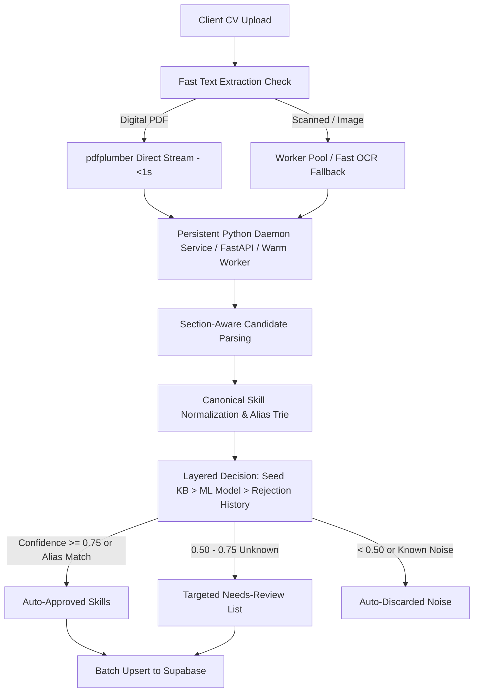
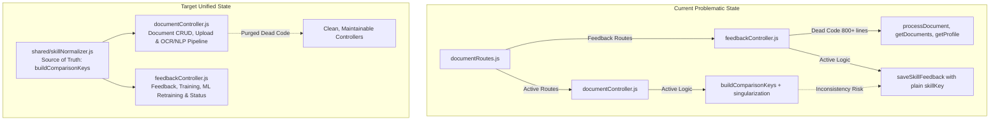

# RMRS Architectural Review & Comprehensive Implementation Plan

> **Project:** Resource Management Recommender System (RMRS)  
> **Tech Stack:** React/Vite Frontend, Node.js/Express Backend, Python OCR/NLP Pipeline, Supabase Database  
> **Document Purpose:** Detailed technical roadmap for pipeline performance optimization, controller consolidation, and recommendation engine precision.

---

## 1. Current-State Summary

### Area A: Document Upload Pipeline (Frontend → Backend → Python OCR/NLP → Supabase)
Document uploads (`POST /api/employee/process-document`) route via [documentRoutes.js](file:///c:/xampp/htdocs/ResourceManagementRecommenderSystem/backend/routes/Employee/documentRoutes.js) into [documentController.js](file:///c:/xampp/htdocs/ResourceManagementRecommenderSystem/backend/controllers/documentController.js), which synchronously writes a temporary file to disk and invokes [pythonService.js](file:///c:/xampp/htdocs/ResourceManagementRecommenderSystem/backend/services/pythonService.js). This spawns a brand-new Python child process running [runner.py](file:///c:/xampp/htdocs/ResourceManagementRecommenderSystem/python/scripts/runner.py) for every upload, incurring a heavy cold-start penalty (loading `spacy.load('en_core_web_md')`, Tesseract, and ML classifiers). In [module1_ocr.py](file:///c:/xampp/htdocs/ResourceManagementRecommenderSystem/python/modules/module1_ocr.py), text-based PDFs extract quickly with `pdfplumber`, but scanned files convert all pages to 150 DPI images via `pdf2image` and run Otsu thresholding + Tesseract sequentially. Extraction in [module2_nlp.py](file:///c:/xampp/htdocs/ResourceManagementRecommenderSystem/python/modules/module2_nlp.py) extracts candidates across the entire document text and routes them through a 3-layer sieve (Knowledge Base, ML Classifier with 0.85/0.65 thresholds, and fallback regex). Any candidate between 0.40–0.85 confidence lands in `needs_review`, leading to inflated manual approval queues.

### Area B: Controller Architecture (documentController.js vs feedbackController.js)
[documentRoutes.js](file:///c:/xampp/htdocs/ResourceManagementRecommenderSystem/backend/routes/Employee/documentRoutes.js) routes core document operations (`/process-document`, `/documents`, `/skills`, `/stats`) exclusively to [documentController.js](file:///c:/xampp/htdocs/ResourceManagementRecommenderSystem/backend/controllers/documentController.js). Meanwhile, [feedbackController.js](file:///c:/xampp/htdocs/ResourceManagementRecommenderSystem/backend/controllers/feedbackController.js) houses an obsolete ~800-line clone of `processDocument`, `getDocuments`, `getProfile`, `updateProfile`, and `getSkills` that is completely unrouted (dead code). The two controllers have diverged significantly: [documentController.js](file:///c:/xampp/htdocs/ResourceManagementRecommenderSystem/backend/controllers/documentController.js) checks history across `feedback_training` using `buildComparisonKeys` (generating strict, compact, singular, and singular-compact keys), whereas [feedbackController.js](file:///c:/xampp/htdocs/ResourceManagementRecommenderSystem/backend/controllers/feedbackController.js) uses a simpler `skillKey` without singularization and checks the `documents` table first. This creates maintenance drift, duplicate logic, and mismatched deduplication behavior between upload scanning and feedback saving.

### Area C: Recommendation Engine (Matching, Scoring, Availability, UI)
The recommender in [recommendationService.js](file:///c:/xampp/htdocs/ResourceManagementRecommenderSystem/backend/services/recommendationService.js) pulls employee skills directly from `employee_skills` joined with `skills` and compares them against requirement skills using 4 tiers: Exact match, Alias match, Component match, and Partial string match. While it assigns weights (`primary: 2`, `secondary: 1`), it aggregates them into a single linear percentage `(matchedWeight / totalWeight)` without a mandatory-skill veto or gate. Crucially, the overall score is purely multiplicative: $\text{recommendationScore} = \text{matchingScore} \times \text{availabilityFactor} \times \text{historicalPerformance}$. Because $\text{availabilityFactor} = 1 - (\text{workload} / 10)$, any employee with $\ge 10$ workload points is assigned an availability of $0$, completely zeroing out their score and hiding well-qualified candidates. On the frontend ([RMRequestsTab.jsx](file:///c:/xampp/htdocs/ResourceManagementRecommenderSystem/main/src/frontend/ResourceManager/RMRequestsTab.jsx)), candidates are displayed with a single percentage score and a tag list of matched/missing skills, lacking an explainable breakdown of whether hard requirements were met versus optional bonuses.

---

## 2. Implementation Plan: Upload Speed & Skill Extraction Accuracy



### Key Bottlenecks Identified
1. **Cold-Start Process Spawning:** Every document upload spawns `python runner.py` through `child_process.spawn`. Loading spaCy's `en_core_web_md` (~40MB binary), PyTorch/Scikit-learn, and database facts takes **2.5–4.0 seconds per upload** before any OCR or extraction begins.
2. **Synchronous HTTP Thread Blocking:** Node.js holds the client's HTTP connection open during file upload, disk write, Python execution, and Supabase writes.
3. **Sequential Full-Page OCR:** When a scanned PDF is processed, `pdf2image` converts all pages at 150 DPI and executes OCR sequentially page-by-page.
4. **Vocabulary & Extraction Noise:** Extraction runs globally across the entire document (headers, footers, addresses, references), extracting noisy noun phrases like `"Project Manager"`, `"Level"`, or `"Basic Use"`, flooding `needs_review`.

---

### Step-by-Step Implementation Steps

#### Step 1: Replace Per-Request Python Spawning with a Warm Local Microservice (or Worker Daemon)
* **Action:** Transition from spawning a fresh Python process per request to running a long-lived Python background daemon (e.g., lightweight FastAPI/Uvicorn on `localhost:5001` or a persistent STDIO worker pool).
* **Details:** Keep the spaCy model (`en_core_web_md`) and Scikit-learn classifier pre-warmed in RAM. [pythonService.js](file:///c:/xampp/htdocs/ResourceManagementRecommenderSystem/backend/services/pythonService.js) sends a fast HTTP POST/IPC message with document text/path.
* **Impact:** **Saves 2.5–4.0 seconds per upload** immediately.
* **Effort / Complexity:** Medium (3–4 days).
* **Risk:** Low. Can maintain a fallback to `child_process.spawn` if the daemon port is unresponsive.

#### Step 2: Streamline OCR & Skip Heavy Preprocessing for Native PDFs
* **Action:** Enforce strict early-exit text extraction in [module1_ocr.py](file:///c:/xampp/htdocs/ResourceManagementRecommenderSystem/python/modules/module1_ocr.py).
* **Details:** If `pdfplumber` yields $\ge 50$ printable words with high dictionary density, completely bypass `pdf2image`, OpenCV, and Tesseract. If OCR is required (scanned PDF), parallelize page OCR using Python's `concurrent.futures.ThreadPoolExecutor(max_workers=3)` instead of serial looping.
* **Impact:** Reduces native PDF processing from **~5–8s down to <1s**; cuts scanned document OCR time by **40–60%**.
* **Effort / Complexity:** Low to Medium (1–2 days).
* **Risk:** Very low. Native text from `pdfplumber` has higher fidelity than OCR output anyway.

#### Step 3: Implement Section-Aware CV Segmentation in NLP Extraction
* **Action:** Add header boundary detection in [module2_nlp.py](file:///c:/xampp/htdocs/ResourceManagementRecommenderSystem/python/modules/module2_nlp.py) before extracting noun chunks.
* **Details:** Detect standard CV section headers (`SKILLS`, `TECHNICAL COMPETENCIES`, `WORK EXPERIENCE`, `EDUCATION`, `PROJECTS`). Boost candidate priority extracted within the `SKILLS` and `PROJECTS` sections. Candidates found under `EDUCATION`, `PERSONAL REFERENCES`, or headers/footers should be filtered out or subjected to higher confidence thresholds.
* **Impact:** Reduces false positives (names, degrees, company names) by **60–70%**.
* **Effort / Complexity:** Medium (2–3 days).
* **Risk:** Edge case where CVs have non-standard layouts or table columns. Mitigated by falling back to full-text scan if no section boundaries are identified.

#### Step 4: Pre-seed Knowledge Base & Broaden High-Confidence Auto-Approval
* **Action:** Lower the ML auto-approval threshold from `0.85` to `0.75` for candidates that match domain patterns or alias tables, while raising the rejection floor from `0.40` to `0.50`.
* **Details:** Pre-seed the `skills` table with standard AEC/IT taxonomy (AutoCAD, Revit, SketchUp, Civil 3D, SolidWorks, Python, React, etc.). When a skill has an exact or compact alias match in the database, auto-approve it immediately without sending it to `needs_review`.
* **Impact:** **Reduces items landing in "Pending Review" by 50–75%**, leaving only genuinely ambiguous phrases for manual review.
* **Effort / Complexity:** Low (1 day).
* **Risk:** Must preserve the check against `feedback_training` so employee-rejected noise (e.g. `"Level"`, `"Engr"`) does not slip into auto-approval.

#### Step 5: Consolidate Database Round-Trips into Batch Operations
* **Action:** Refactor [documentController.js](file:///c:/xampp/htdocs/ResourceManagementRecommenderSystem/backend/controllers/documentController.js) and [storageService.js](file:///c:/xampp/htdocs/ResourceManagementRecommenderSystem/backend/services/storageService.js) to execute Supabase operations concurrently where possible.
* **Details:** Run `storageService.uploadFile` and employee feedback history queries in parallel with `Promise.all()`. Cache the master `skills` list and `global_rejected_noise` in Node memory for 5 minutes (invalidated on new skill approval).
* **Impact:** Cuts **300–600ms** of database latency per upload.
* **Effort / Complexity:** Low (1 day).
* **Risk:** None.

---

## 3. Merge Recommendation & Plan: `documentController.js` vs `feedbackController.js`

### Clear Verdict: Do NOT Naively Merge Everything — Extract Shared Logic & Delete Dead Code



### Analysis: Where/Why Merging Helps & Risks
1. **The Dead Code Risk:** [feedbackController.js](file:///c:/xampp/htdocs/ResourceManagementRecommenderSystem/backend/controllers/feedbackController.js) contains lines 479–1033 with duplicate implementations of `processDocument`, `getDocuments`, `getProfile`, `updateProfile`, `getSkills`, and `getStats`. None of these routes are mounted in [documentRoutes.js](file:///c:/xampp/htdocs/ResourceManagementRecommenderSystem/backend/routes/Employee/documentRoutes.js). Keeping them is dangerous because developers may update logic in `feedbackController.js` believing it handles uploads, when in reality [documentController.js](file:///c:/xampp/htdocs/ResourceManagementRecommenderSystem/backend/controllers/documentController.js) is executing.
2. **Differing Matching Logic (The Critical Breaking Point):**
   * [documentController.js](file:///c:/xampp/htdocs/ResourceManagementRecommenderSystem/backend/controllers/documentController.js) uses `buildComparisonKeys` which generates four variants:
     1. Strict key: `normalizeSkill(s).toLowerCase()`
     2. Compact key: `replace(/[^a-z0-9]+/g, '')`
     3. Singular key: handles `-ies` $\to$ `-y`, `-ses`/`-xes`/`-zes` $\to$ base, trailing `-s` $\to$ base
     4. Singular-compact key
   * [feedbackController.js](file:///c:/xampp/htdocs/ResourceManagementRecommenderSystem/backend/controllers/feedbackController.js) uses a simpler `skillKey`: `normalizeSkill(s).toLowerCase().replace(/\s+/g, ' ').trim()`.
   * **What breaks if merged naively:** If you merge and adopt the simpler `skillKey`, **rejected skills will resurface**! For example, if an employee rejects `"AutoCAD Drafting Details"`, singularization matches `"AutoCAD Drafting Detail"`. Dropping `buildComparisonKeys` causes previously rejected plurals/singulars to reappear as pending review. Furthermore, if you adopt `feedbackController`'s document-level lookup rather than `documentController`'s employee-wide `feedback_training` lookup, rejected skills on Document A will reappear whenever Document B is uploaded.

### Recommended Architectural Solution
Keep the two controllers separated by domain responsibility, but **eliminate dead code** and **extract skill normalization into a shared utility**:
* **[documentController.js](file:///c:/xampp/htdocs/ResourceManagementRecommenderSystem/backend/controllers/documentController.js):** Retains Document lifecycle: file upload, OCR/NLP pipeline orchestration, document list, document OCR text view.
* **[feedbackController.js](file:///c:/xampp/htdocs/ResourceManagementRecommenderSystem/backend/controllers/feedbackController.js):** Retains ML & Feedback lifecycle: `/skill-feedback`, `/pending-feedback`, `/ml-status`, `/feedback-stats`, `/cleanup-duplicates`, `/retrain-ml`.
* **Extract `backend/utils/skillNormalizer.js`:** Single source of truth containing `buildComparisonKeys`, `normalizeSkill`, `skillKey`, and singularization routines, imported by both controllers and the recommendation engine.

---

### Step-by-Step Execution Plan

#### Step 1: Extract Shared Normalization Utility (`backend/utils/skillNormalizer.js`)
* Extract the robust `buildComparisonKeys`, `singularizeToken`, `compactSkillKey`, and `normalizeSkill` from [documentController.js](file:///c:/xampp/htdocs/ResourceManagementRecommenderSystem/backend/controllers/documentController.js) into `backend/utils/skillNormalizer.js`.
* Update both controllers to import from this shared utility.

#### Step 2: Update `feedbackController.saveSkillFeedback` to Use `buildComparisonKeys`
* In `feedbackController.saveSkillFeedback`, update the check against existing feedback rows to use `hasComparisonKey(existingKeys, phrase)`.
* This ensures that when a human approves or rejects a skill, its singular, plural, and compact variations are indexed consistently across both tables (`feedback_training` and `employee_skills`).

#### Step 3: Purge Dead Unrouted Functions from `feedbackController.js`
* Safely remove the unrouted methods from [feedbackController.js](file:///c:/xampp/htdocs/ResourceManagementRecommenderSystem/backend/controllers/feedbackController.js):
  - Remove dead `exports.processDocument` (lines 479–750).
  - Remove dead `exports.getDocuments` (lines 752–797).
  - Remove dead `exports.getProfile` and `exports.updateProfile` (lines 847–950).
  - Remove dead `exports.getSkills` and `exports.getStats`.
* Move `exports.getDocumentOcrText` into [documentController.js](file:///c:/xampp/htdocs/ResourceManagementRecommenderSystem/backend/controllers/documentController.js) where all other `/documents/*` routes live.

#### Step 4: Verification & Testing Checkpoints
* **Checkpoint A (Upload Regression Test):** Upload a test CV. Verify skills extract and save through `documentController.processDocument` without missing imports.
* **Checkpoint B (Rejection Resurfacing Test):** Reject a plural skill (e.g. `"Electrical Systems"`). Re-upload a document containing `"Electrical System"`. Confirm it is filtered out and does not appear in pending review.
* **Checkpoint C (Feedback Save Test):** Approve 2 skills and reject 1. Verify `saveSkillFeedback` properly links skills to `employee_skills` and saves to `feedback_training` without duplicates.

---

## 4. Implementation Plan: Recommendation Engine (Skill Matching & Prioritization)

```mermaid
flowchart LR
    subgraph Requirements
        R1[Primary / Mandatory Skills<br/>Weight: 3.0]
        R2[Secondary / Nice-to-Have<br/>Weight: 1.0]
    end

    subgraph Candidate Skills
        CS[Employee Verified Skills]
    end

    subgraph Matching Engine
        M1[Tier 1: Exact / Canonical Match]
        M2[Tier 2: Alias / Master Taxonomy]
        M3[Tier 3: Component Sub-skill Match]
        M4[Tier 4: Token / Fuzzy Levenshtein]
    end

    Requirements --> Matching Engine
    Candidate Skills --> Matching Engine
    
    Matching Engine --> SC[Skill Match Score: 0 - 100%]
    SC --> Gate{Are Hard Prerequisites Met?}
    Gate -->|No: < 50% Primary| Penalty[Apply Primary Shortfall Penalty]
    Gate -->|Yes| Composite
    Penalty --> Composite[Composite Score Formula]
    
    AF[Availability & Workload Factor] --> Composite
    HP[Historical Performance] --> Composite
    
    Composite --> UI[Explainable UI Output Breakdown]
```

### 1. Distinguishing & Weighting Priority/Required vs Secondary Skills
* **Current Issue:** Primary skills have weight 2, secondary have weight 1. An employee missing all primary skills can still score 70%+ if they match multiple secondary skills and have zero workload.
* **Implementation:**
  * Adopt an asymmetric weighted model: **Required Skills Weight = 4.0**, **Secondary Skills Weight = 1.0**.
  * Add a **Mandatory Prerequisite Factor ($F_{\text{req}}$)**:
    $$F_{\text{req}} = \frac{\text{Primary Skills Matched}}{\text{Total Primary Skills Required}}$$
  * If $F_{\text{req}} < 0.50$ (less than half of the mandatory skills are met), apply an exponential reduction factor or set candidate category to `"Not Qualified"` / `"Missing Core Skills"`. This prevents secondary matches from masking core incompetencies.

### 2. Factoring Availability Without Zeroing Out Viable Candidates
* **Current Issue:** $\text{availabilityFactor} = 1 - (\text{workload} / 10)$. At workload $\ge 10$, availability becomes $0$, multiplying the total score by $0$ ($\text{score} = 0$). Even if an employee is a 100% perfect match, they completely vanish or drop to the bottom with 0%.
* **Implementation:**
  * Switch from strict multiplicative zeroing to a **weighted multi-criteria utility formula**:
    $$\text{Final Score} = (w_s \cdot \text{SkillMatch}) + (w_a \cdot \text{Availability}) + (w_p \cdot \text{Performance})$$
    Recommended weights: $w_s = 0.60$, $w_a = 0.25$, $w_p = 0.15$.
  * Use a non-linear decay curve for availability rather than an abrupt cutoff:
    $$\text{Availability} = \frac{1}{1 + e^{0.4 \cdot (\text{workload} - 7)}}$$
    * At workload 0–4: Availability $\approx 95\% - 85\%$.
    * At workload 7: Availability $= 50\%$.
    * At workload 10+: Availability $\approx 15\% - 20\%$ (still visible as a skilled backup, with a clear `"High Workload"` warning badge).

### 3. Accurate & Robust Skill Matching
* **Unified Canonical Aliasing:** Import the shared `buildComparisonKeys` in [recommendationService.js](file:///c:/xampp/htdocs/ResourceManagementRecommenderSystem/backend/services/recommendationService.js).
* **Fuzzy Token Matching (Tier 4 replacement):** Currently, Tier 4 partial matching uses `includes()`, causing false matches (e.g. `"Java"` matching `"JavaScript"`, or `"Art"` matching `"Smart"`). Replace substring `includes` with **token-level Jaccard similarity or Levenshtein distance** ($\ge 0.85$ ratio on whole words only).
* **NLP Extraction Confidence Discount:** Add an `is_verified` multiplier. Skills approved by RM/HR or backed by PRC license receive a $1.0$ weight; unverified skills auto-extracted without review receive a $0.85$ weight.

### 4. Explainable Output Breakdown for the Frontend
* **Payload Transformation:** Enhance the response payload from [recommendationController.js](file:///c:/xampp/htdocs/ResourceManagementRecommenderSystem/backend/controllers/recommendationController.js) and [recommendationService.js](file:///c:/xampp/htdocs/ResourceManagementRecommenderSystem/backend/services/recommendationService.js):
  ```json
  {
    "employeeId": "EMP-0012",
    "name": "Maria Santos",
    "compositeScore": 88,
    "breakdown": {
      "skillMatchScore": 92,
      "primarySkills": {
        "matched": ["AutoCAD 2D", "Revit Architecture"],
        "missing": [],
        "fulfillment": "2/2 (100%)"
      },
      "secondarySkills": {
        "matched": ["BIM Modeling"],
        "missing": ["Civil 3D"],
        "fulfillment": "1/2 (50%)"
      },
      "matchDetails": [
        { "required": "AutoCAD", "matchedWith": "AutoCAD 2D", "type": "alias" }
      ],
      "availability": {
        "score": 85,
        "activeTasks": 2,
        "workloadPoints": 4,
        "status": "Available"
      },
      "performance": {
        "score": 90,
        "clientRating": 4.5,
        "reviewCount": 6
      }
    }
  }
  ```
* **Frontend Presentation in [RMRequestsTab.jsx](file:///c:/xampp/htdocs/ResourceManagementRecommenderSystem/main/src/frontend/ResourceManager/RMRequestsTab.jsx):**
  * Replace the single score badge with an intuitive pill: **"92% Match • Available (2 Tasks)"**.
  * Separate the skills display into two distinct rows:
    * **Required:** Green tags for met mandatory skills, bold red dashed tags for missing mandatory skills.
    * **Nice-to-Have:** Muted blue tags for bonus skills met.
  * Hover tooltip on any matched tag showing match tier (e.g., *"Matched via alias: AutoCAD 2D $\to$ AutoCAD"*).

---

## 5. Suggested Priority & Sequencing Roadmap

```mermaid
gantt
    title RMRS Implementation Sequencing
    dateFormat  X
    axisFormat Phase %d

    section Phase 1: Foundations
    Extract skillNormalizer.js & Purge Dead Code :0, 2
    Fix saveSkillFeedback Comparison Consistency  :1, 3

    section Phase 2: Recommendation Engine
    Refactor recommendationService Scoring Model :2, 5
    Upgrade Partial Matching to Fuzzy Token/Alias  :3, 5
    Update Frontend Explainability in RMRequestsTab :4, 6

    section Phase 3: Extraction Speed & Accuracy
    Section-Aware CV Parsing in NLP                :5, 7
    Bypass OCR for Native Digital PDFs             :6, 8
    Pre-warm Python Microservice / Worker Daemon   :7, 10
```



| Phase | Tasks | Rationale & Dependencies | Estimated Effort |
|---|---|---|---|
| **Phase 1 (Day 1–2): Architecture & Normalization Foundation** | 1. Extract `backend/utils/skillNormalizer.js` with `buildComparisonKeys`.<br>2. Clean out dead code in `feedbackController.js`.<br>3. Align `saveSkillFeedback` to use canonical keys. | **Highest ROI & zero risk.** Eliminates the two-source-of-truth bug, prevents rejected skills from resurfacing, and provides the foundation for recommendation matching. | 1–2 days |
| **Phase 2 (Day 3–5): Recommendation Engine Accuracy & Explainability** | 1. Implement required vs secondary weighting & prerequisite gating.<br>2. Replace multiplicative zeroing with weighted composite availability formula.<br>3. Replace substring `includes()` with token-level fuzzy matching.<br>4. Update [RMRequestsTab.jsx](file:///c:/xampp/htdocs/ResourceManagementRecommenderSystem/main/src/frontend/ResourceManager/RMRequestsTab.jsx) to display required vs secondary skill breakdown. | Directly improves business decision-making for Resource Managers. Recommender depends on clean skills established in Phase 1. | 2–3 days |
| **Phase 3 (Day 6–8): Upload Speed & Skill Extraction Pipeline** | 1. Add section boundary detection (`SKILLS`, `EXPERIENCE`) in [module2_nlp.py](file:///c:/xampp/htdocs/ResourceManagementRecommenderSystem/python/modules/module2_nlp.py).<br>2. Bypass OCR for native digital PDFs in [module1_ocr.py](file:///c:/xampp/htdocs/ResourceManagementRecommenderSystem/python/modules/module1_ocr.py).<br>3. Adjust auto-approval threshold to 0.75 for recognized dictionary skills.<br>4. Set up a persistent warm Python worker daemon. | Major performance and UX upgrade. Done after controller and recommendation layers are stable so extraction feeds directly into a solid foundation. | 3–4 days |
